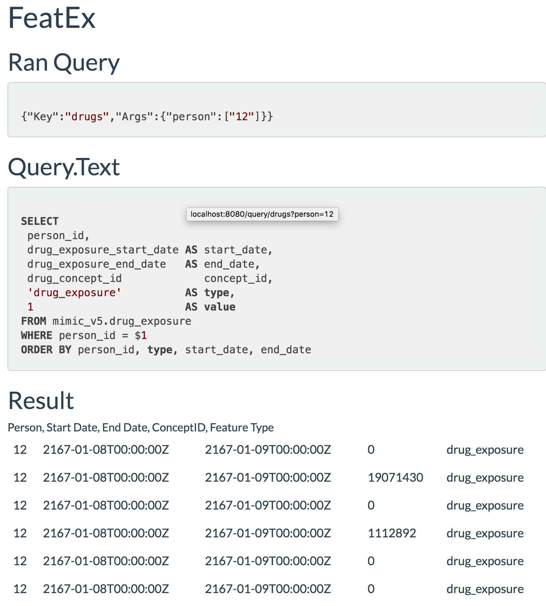
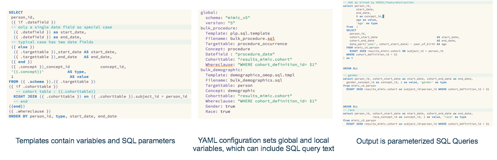
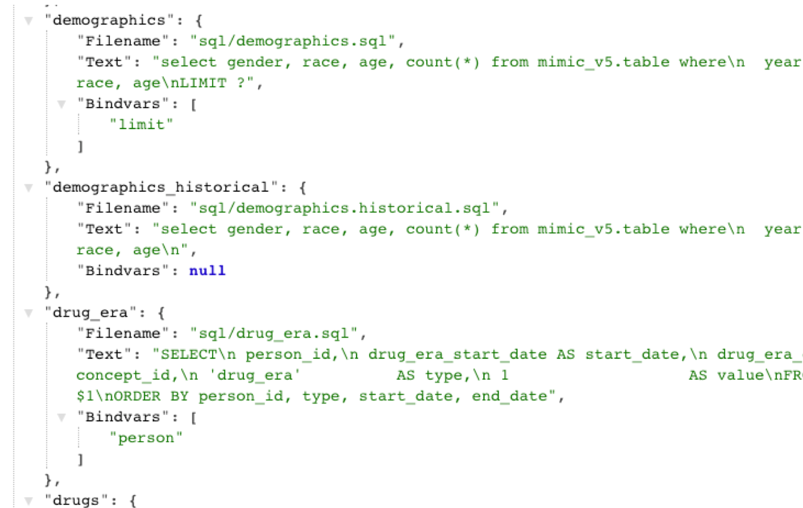

QueryGarden
===========

Growing healthy applications in well-prepared SQL.

Many software packages within the OHDSI ecosystem rely on SQL query
generation, which is fraught with security risks and compatibility
issues. We introduce an ahead of time query server, QueryGarden, to
enable access to queries over HTTP to reduce the risk of SQL injection
attacks, improve the lifecycle management of analytical queries and
provide both batch processing for training analytics models as well as
single patient queries for near real time applications. The Query Garden
is a place to plant queries for analytics that grow into stable, secure,
and user friendly applications.

This software has been presented at the OHDSI Symposium as research software.
For more details click [here](/querygarden/ohdsi.html).

Screenshots
-----------
QueryGarden can be used to build dynamic web applications that use SQL to provde analytics information that goes beyong ORM or SQL parameterization.

### querygen for flexible query generation
The Queries are generated using the querygen module which builds on YAML and Go text templates (similar to mustaches) for a standardized easy to use and extend system for generating queries.

### managing collections of queries
Once loaded by the FeatEx web applications, the queries and their parameters can be inspected programatically, a feature that can be used by front end applications to build advanced user interfaces.

